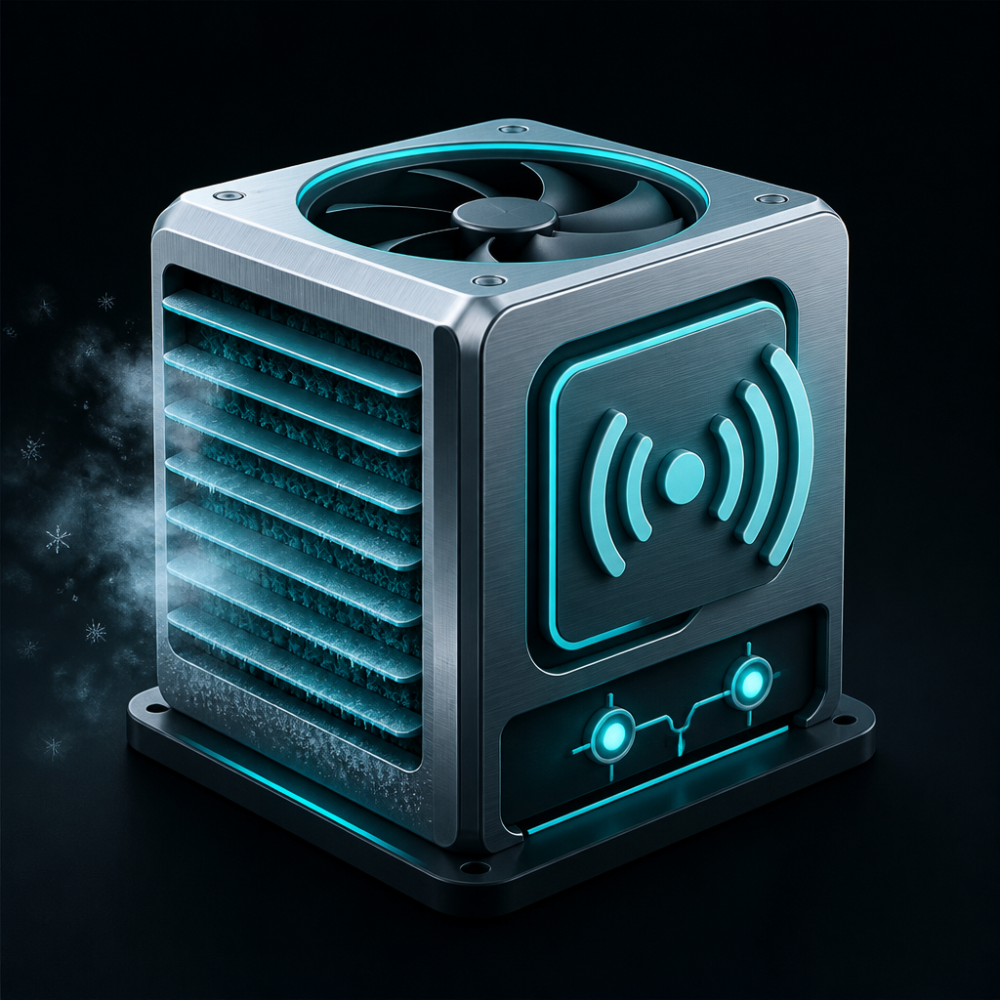
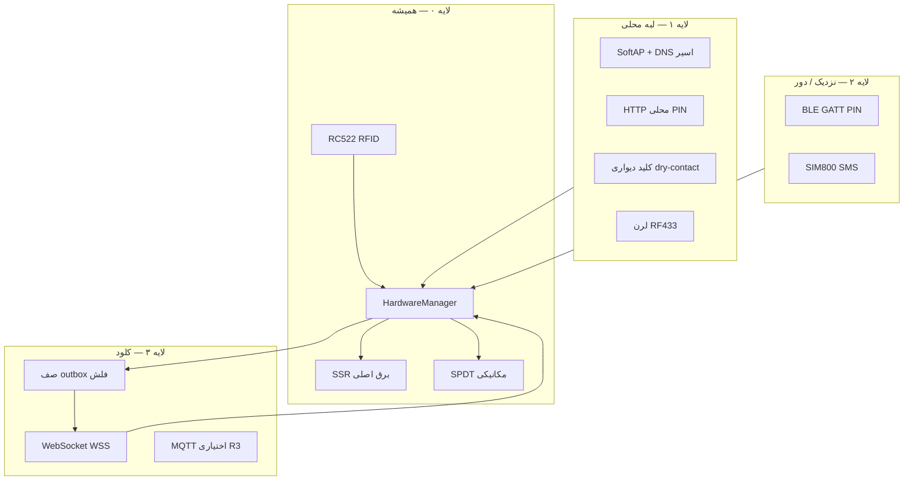
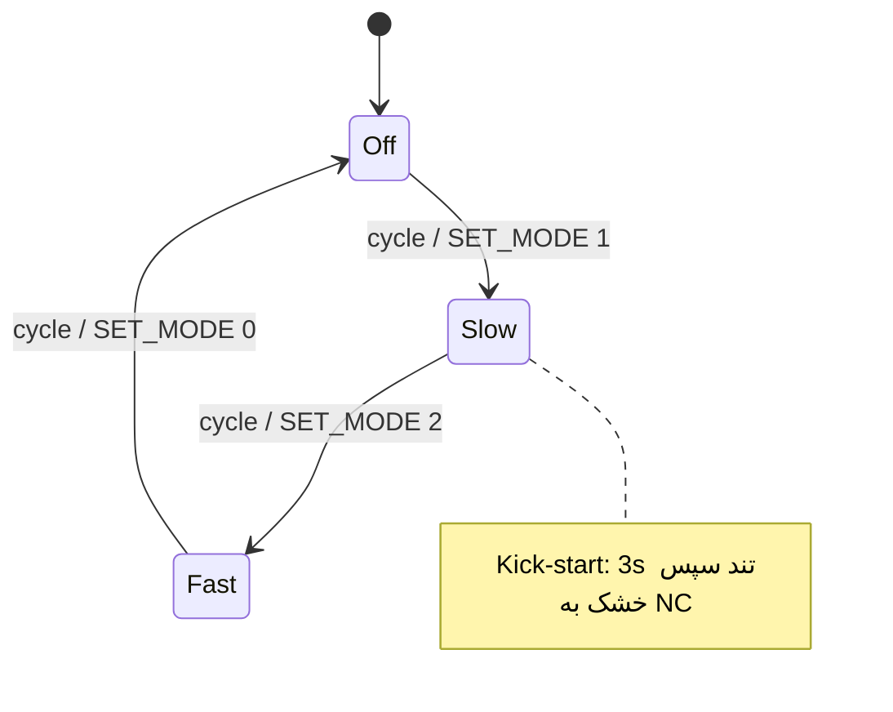

[English](README.md) · **فارسی**

# RFID Cooler Controller

**فریم‌ور صنعتی آفلاین-اول ESP32 — دسترسی RFID، کنترل خشک ۳سرعته، اختیاری کلود چندمستأجر.**

MicroPython · RC522 RFID · SSR + SPDT · [پیکربندی](config.example.json) · [مرکز مستندات](docs/README.fa.md) · [نصب](INSTALL.fa.md)

---

> این فایل ترجمهٔ همراه [`README.md`](README.md) است. **منبع حقیقت انگلیسی است**؛
> در تعارض، نسخهٔ انگلیسی اولویت دارد.

## فهرست مطالب

<strong>پرش به بخش</strong>

- [این پروژه چیست؟](#این-پروژه-چیست)
- [ویژگی‌های کلیدی](#ویژگی‌های-کلیدی)
- [معماری](#معماری)
- [سخت‌افزار](#سخت‌افزار)
- [ماشین حالت](#ماشین-حالت)
- [کارت مستر و Learn Mode](#کارت-مستر)
- [پیکربندی](#پیکربندی-configjson)
- [پروتکل دوحالته](#پروتکل-دوحالته)
- [کانال‌های تاب‌آوری](#کانال‌های-تاب‌آوری-پرچم‌های-config)
- [داشبورد / بک‌اند](#داشبورد--بک‌اند)
- [چیدمان مخزن](#چیدمان-مخزن)
- [شروع سریع](#شروع-سریع)
- [چک‌لیست سخت‌افزار](#چک‌لیست-سخت‌افزار)
- [ایمنی](#ایمنی)
- [مستندات](#مستندات)
- [مشارکت](#مشارکت)
- [لایسنس](#لایسنس)

---

## این پروژه چیست؟

فریم‌ور **کولر آبی ۳حالته** (خاموش / کند / تند) روی ESP32 + MicroPython:

- **لایه ۰ (همیشه):** RFID + توالی رله خشک + Learn Mode
- **لایه ۱+ (اختیاری):** SoftAP، HTTP محلی، کلید دیواری، RF433، BLE، SMS، WSS کلود

RFID آفلاین و کارت مستر فیزیکی **همیشه** بر سوکت مرده اولویت دارند. Learn Mode فرمان موتور از راه دور را رد می‌کند.

| فیلد | جزئیات |
|------|--------|
| **MCU** | ESP32، MicroPython |
| **دسترسی** | RC522 13.56 MHz (فقط 3.3V) |
| **مسیر برق** | SSR AC (اصلی) + رله مکانیکی SPDT (سرعت) |
| **کلود** | WSS اختیاری به FastAPI (SentryGate / `door_control`) |
| **UI** | داشبورد Next.js `cooler-web` در حالت آنلاین |
| **وضعیت** | کانال‌های P0 پیاده‌شده؛ OTA فقط stub ([`docs/OTA.fa.md`](docs/OTA.fa.md)) |

---

## ویژگی‌های کلیدی

- **معماری ۲رله:** SSR (برق اصلی) + SPDT مکانیکی (مسیر سرعت)
- **سوئیچینگ خشک:** رله مکانیکی فقط وقتی SSR خاموش است جابه‌جا می‌شود
- **Kick-start:** حالت کند ۳ثانیه در تند شروع می‌شود، سپس خشک به کند می‌رود (قابل لغو)
- **لغو تسک:** ضربه‌های سریع کارت، توالی رله در حال اجرا را با `force_off` ایمن لغو می‌کند
- **ذخیره اتمیک کارت:** `cards.tmp` → `cards.json`
- **کارت مستر:** ضربه کوتاه (در رها کردن) چرخه کولر؛ نگه‌داشت ۴ثانیه ورود/خروج Learn Mode
- **آنلاین اختیاری:** WiFi + WSS وقتی `online_enabled: true`

---

## معماری

**قانون طلایی:** از دست دادن هر لایهٔ بالاتر هرگز لایه ۰ را از کار نمی‌اندازد.

[`docs/PRODUCT_ROADMAP_RESILIENCE.fa.md`](docs/PRODUCT_ROADMAP_RESILIENCE.fa.md)

---

## سخت‌افزار

| قطعه | یادداشت |
|------|---------|
| ESP32 | MicroPython |
| RC522 RFID | 13.56 MHz، **فقط 3.3V** |
| SSR AC | برق اصلی (GPIO 16، active-low) |
| رله مکانیکی 5V | SPDT COM/NC/NO (GPIO 32، active-low) |
| بازر غیرفعال | GPIO 17 PWM |

### SPI RFID

| RC522 | ESP32 |
|-------|-------|
| SDA (CS) | GPIO 5 |
| SCK | GPIO 18 |
| MOSI | GPIO 23 |
| MISO | GPIO 19 |
| RST | GPIO 4 |

### رله‌ها / بازر

| دستگاه | GPIO | نقش |
|--------|------|------|
| بازر | 17 | UI صوتی PWM |
| SSR | 16 | برق شهر |
| مکانیکی | 32 | انتخاب سرعت |

**حقیقت سیم‌کشی (باید با فریم‌ور یکی باشد):**

- مکانیکی **NC → کند**، **NO → تند**
- خروجی active-low: `1 = خاموش`، `0 = روشن`
- خروجی SSR فاز پمپ + COM مکانیکی را تغذیه می‌کند
- نول سوییچ نمی‌شود

اسنubber RC روی کنتاکت‌های موتور القایی توصیه می‌شود.

---

## ماشین حالت

| حالت | SSR | مک | مسیر |
|------|-----|-----|------|
| 0 خاموش | OFF | OFF | بدون برق |
| 1 کند | ON | OFF | COM→NC بعد از kick-start |
| 2 تند | ON | ON | COM→NO |

---

## کارت مستر

- **ضربه کوتاه (رها کردن قبل ۴ث):** چرخه خاموش → کند → تند → خاموش
- **نگه‌داشت بلند (۴ث):** ورود/خروج Learn Mode؛ موتور اجبار خاموش
- تحمل jitter: مستر تا ۱.۵ث می‌تواند ناپدید شود بدون پایان hold

## Learn Mode

- موتور قفل خاموش؛ `SET_MODE`/`CYCLE` رد می‌شود
- اسکن کارت کاربر: افزودن/حذف در `cards.json`
- خروج: ضربه کوتاه مستر، نگه‌داشت بلند مستر، یا timeout ۱۵ث

---

## پیکربندی (`config.json`)

کپی [`config.example.json`](config.example.json) → `config.json` روی دستگاه.  
**فایل نمونه فقط placeholder — هرگز secret واقعی commit نکنید.**

| کلید | هدف |
|------|-----|
| `wifi_ssid` / `wifi_pass` | اعتبار STA |
| `server_host` / `server_port` / `use_ssl` / `ws_path` | بک‌اند |
| `hardware_token` | توکن per-device از داشبورد |
| `device_id` | شناسه یکتا کولر |
| `device_role` | `cooler` |
| `online_enabled` | `false` = آفلاین خالص |
| `temp_enabled` | رزرو (بدون سنسور) |
| `ap_enabled` | SoftAP وقتی STA fail |
| `lan_http_enabled` | HTTP روی IP استیشن |
| `local_pin` | PIN وب محلی / مشتق PSK SoftAP |
| `outbox_enabled` | صف فلش + ACK روی WSS |
| `wall_enabled` | GPIO کلید دیواری |
| `rf433_enabled` | لرن ریموت 433MHz ایران |
| `ble_enabled` | GATT PIN (`aioble`) |
| `sms_uart_enabled` | SIM800 |
| `mqtt_enabled` | بروکر محلی (فقط اگر reachable) |

`boot.py` روی WiFi **block** نمی‌کند. شبکه فقط از `main.py` وقتی online فعال است شروع می‌شود.

### URL آنلاین

`wss://your-server.example.com/ws/hardware?token=DEVICE_TOKEN&role=cooler&device_id=DEVICE_ID`

---

## پروتکل دوحالته

همان مسیر WebSocket در hardware درب، با `role=cooler` + `device_id`:

**Uplink (دستگاه → سرور)**

- `{"type":"ping"}`
- `{"type":"status","cooler_state":0|1|2,"learn_mode":bool,...}`
- `{"type":"scan","rfid":"0x…","action":"cycle|denied|learn_*",…}`
- `{"type":"ACK","command_id":"…","status":"accepted|applied|rejected",…}`

**Downlink (سرور → دستگاه)**

- `{"cmd":"SET_MODE","mode":0|1|2,"command_id":"…"}`
- `{"cmd":"CYCLE","command_id":"…"}`
- `{"cmd":"GET_STATUS"}`
- `OPEN` → **نادیده**؛ `DENY` → فقط بوق

---

## کانال‌های تاب‌آوری (پرچم‌های config)

| پرچم | کانال |
|------|--------|
| (همیشه) | RFID + dry-switch |
| `ap_enabled` / بدون WiFi | SoftAP + captive + PIN |
| `lan_http_enabled` | HTTP روی STA |
| `wall_enabled` | کلید دیواری dry-contact |
| `outbox_enabled` | outbox + ACK WSS |
| `rf433_enabled` | لرن 433 ایران |
| `ble_enabled` | BLE GATT |
| `sms_uart_enabled` | SIM800 |
| `mqtt_enabled` | MQTT retain (R3) |

**PSK SoftAP:** از `local_pin` مشتق می‌شود (تکرار تا ≥۸ کاراکتر، مثلاً `1234` → `12341234`).

**پین پیشنهادی:** دیواری Off/Slow/Fast = `33/14/15`؛ RF433 = `27`؛ SMS UART = `26/25`.

**R3 معوق:** `temp_enabled` بدون سنسور؛ OTA stub — [`docs/OTA.fa.md`](docs/OTA.fa.md).

---

## داشبورد / بک‌اند

- FastAPI: `door_control` — مشتری، کولر، توکن، RBAC
- Next.js: [`door_control/cooler-web`](../door_control/cooler-web/README.md)

---

## چیدمان مخزن

| مسیر | نقش |
|------|------|
| `main.py` | RFID + رله + bootstrap کانال‌ها |
| `boot.py` | بوت مینیمال |
| `mfrc522.py` | درایور RFID |
| `wifi_manager.py` / `ap_manager.py` | STA / SoftAP |
| `local_http.py` / `dns_captive.py` | وب محلی |
| `outbox.py` / `cloud.py` / `ws_client.py` | outbox + WSS |
| `wall_inputs.py` / `rf433.py` / `ble_control.py` / `sms_modem.py` | کانال‌های لبه |
| `scripts/validate.py` | اعتبارسنجی host-side |
| `docs/` | مرکز مستندات |

---

## شروع سریع

### آفلاین

1. `MASTER_CARD_UID` را تنظیم کنید (`DEBUG_MODE = True` یک‌بار برای چاپ UID).
2. MicroPython + فایل‌های فریم‌ور را فلش کنید.
3. `online_enabled` false بگذارید.
4. نگه‌داشت بلند مستر → learn → ضربه کوتاه.

### آنلاین

1. مشتری + کولر در `cooler-web`؛ `device_id` + token.
2. `config.json` از `config.example.json`.
3. `online_enabled: true` و آپلود.
4. کنترل از داشبورد؛ RFID با قطع WiFi هم کار می‌کند.

جزئیات: [`INSTALL.fa.md`](INSTALL.fa.md).

---

## چک‌لیست سخت‌افزار

1. بوت بدون WiFi → RFID/رله فوری  
2. قطع WiFi وسط کار → موتور حالت را نگه می‌دارد  
3. `SET_MODE` آنلاین؛ رد در Learn Mode  
4. لغو kick-start وسط ۳ث ایمن  
5. قطع برق هنگام save → بازیابی از `cards.tmp`  
6. `OPEN` درب هرگز این کولر را حرکت نمی‌دهد  

---

## ایمنی

سیم‌کشی برق شهر خطرناک است. قبل از سیم‌کشی برق را قطع کنید. در شک، برقکار مجاز. TLS MicroPython ممکن است محدود باشد؛ WSS + توکن قوی per-device.

**هرگز** پریز تک‌کانال را برای Off/Slow/Fast موتور استفاده نکنید — [`docs/SKU_LITE_SMART_PLUG.fa.md`](docs/SKU_LITE_SMART_PLUG.fa.md).

---

## مستندات

| سند | محتوا |
|-----|--------|
| [`README.md`](README.md) | README انگلیسی |
| [`INSTALL.fa.md`](INSTALL.fa.md) | نصب و فلش |
| [`docs/README.fa.md`](docs/README.fa.md) | مرکز مستندات فارسی |
| [`docs/PRODUCT_ROADMAP_RESILIENCE.fa.md`](docs/PRODUCT_ROADMAP_RESILIENCE.fa.md) | نقشه تاب‌آوری |
| [`docs/IRAN_MIRRORS.fa.md`](docs/IRAN_MIRRORS.fa.md) | میرور چابکان |
| [`docs/LOGO_PROMPT.md`](docs/LOGO_PROMPT.md) | پرامپت لوگو 3D |

---

## مشارکت

[`CONTRIBUTING.fa.md`](CONTRIBUTING.fa.md) — قبل از PR: `python scripts/validate.py`.

---

## لایسنس

MIT — [`LICENSE`](LICENSE).

---

**RFID Cooler Controller** — آفلاین اول، آنلاین best-effort. برای محیط‌های صنعتی سخت.

**زبان‌ها:** [English](README.md) · [فارسی](README.fa.md)
