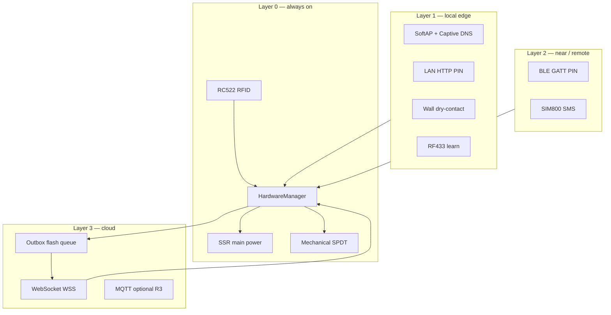
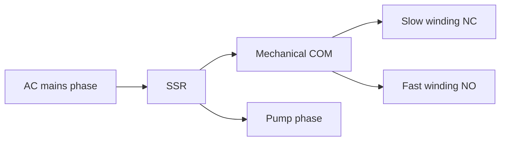
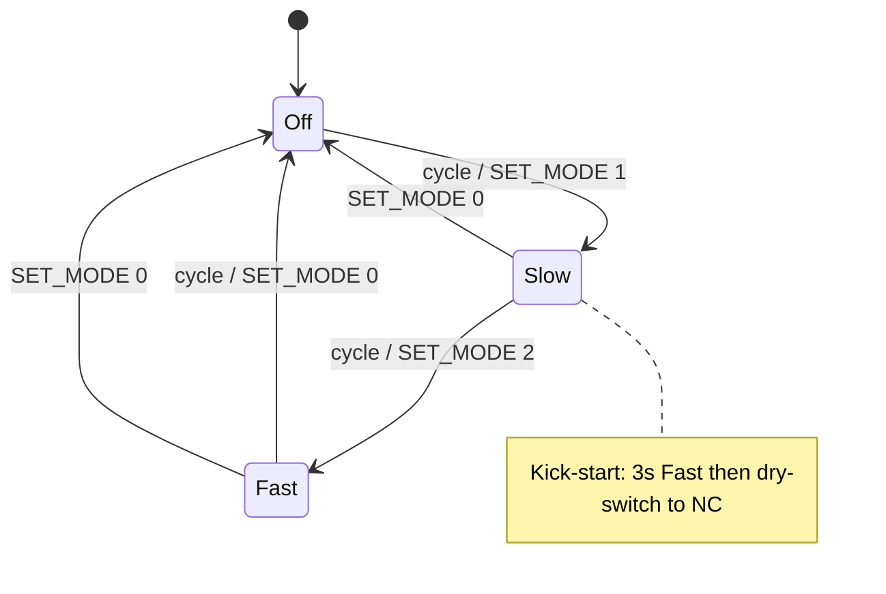
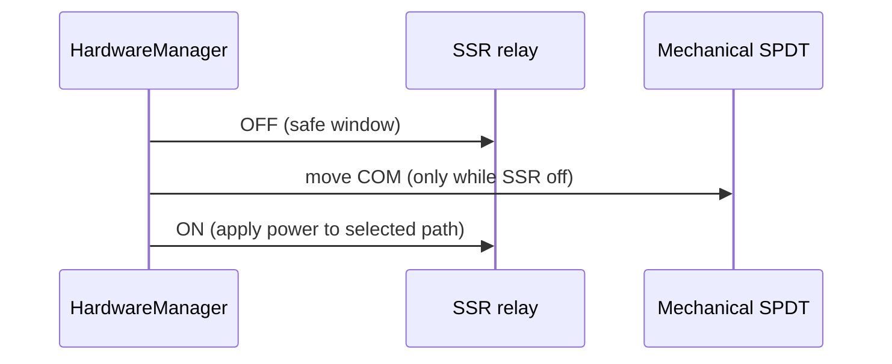
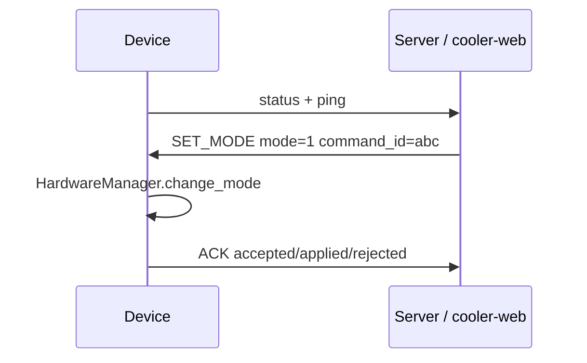

<div align="center">

**English** · [Persian](README.fa.md)


# RFID Cooler Controller

**Industrial-grade offline-first ESP32 firmware — RFID access, dry-switch 3-speed control, optional multi-tenant cloud.**

[](.github/workflows/ci.yml)
[](https://micropython.org/)
[](LICENSE)
[](#architecture)
[](#dual-mode-protocol)
[](docs/PRODUCT_ROADMAP_RESILIENCE.md)

MicroPython · RC522 RFID · SSR + SPDT · [Config](config.example.json) · [Docs hub](docs/README.md) · [Install](INSTALL.md)

</div>

---

## Table of Contents

<details open>
<summary><strong>Jump to section</strong></summary>

- [What is this?](#what-is-this)
- [Key features](#key-features)
- [Architecture](#architecture)
- [Hardware](#hardware)
- [State machine](#state-machine)
- [Master card & Learn Mode](#master-card)
- [Configuration](#configuration-configjson)
- [Dual-mode protocol](#dual-mode-protocol)
- [Resilience channels](#resilience-channels-config-flags)
- [Dashboard / backend](#dashboard--backend)
- [Repository layout](#repository-layout)
- [Quick start](#quick-start)
- [Hardware checklist](#hardware-checklist)
- [Safety](#safety)
- [Documentation](#documentation)
- [Contributing](#contributing)
- [License](#license)

</details>

---

## What is this?

Firmware for a **3-state evaporative cooler** (Off / Slow / Fast) on ESP32 + MicroPython:

- **Layer 0 (always):** RFID cards + dry-switch relay sequence + Learn Mode
- **Layer 1+ (optional):** WiFi SoftAP, LAN HTTP, wall inputs, RF433, BLE, SMS, cloud WSS

Offline RFID and the physical master card **always win** over a dead socket. Learn Mode rejects remote motor commands.

| Field | Detail |
|-------|--------|
| **MCU** | ESP32, MicroPython |
| **Access** | RC522 13.56 MHz RFID (3.3 V only) |
| **Power path** | AC SSR (main) + 5 V mechanical SPDT (speed) |
| **Cloud** | Optional WSS to FastAPI backend (SentryGate / `door_control`) |
| **UI** | Next.js `cooler-web` dashboard when online |
| **Status** | Production P0 resilience channels implemented; OTA stub-only ([`docs/OTA.md`](docs/OTA.md)) |

---

## Key features

- **2-relay architecture:** SSR (main power) + mechanical SPDT (speed path)
- **Dry switching:** mechanical relay only moves while SSR is off
- **Kick-start:** Slow mode starts in Fast for 3s, then dry-switches to Slow (cancellable)
- **Task cancellation:** rapid card taps cancel in-flight relay sequences safely (`force_off` on cancel)
- **Atomic card store:** `cards.tmp` → `cards.json`
- **Master card:** short tap (on release) cycles cooler; 4s hold enters/exits Learn Mode
- **Optional online:** WiFi + WSS when `online_enabled` is true in `config.json`

---

## Architecture



**Golden rule:** losing any upper layer never disables Layer 0.

See [`docs/PRODUCT_ROADMAP_RESILIENCE.md`](docs/PRODUCT_ROADMAP_RESILIENCE.md) for the full Iran resilience product map.

---

## Hardware

| Part | Notes |
|------|--------|
| ESP32 | MicroPython |
| RC522 RFID | 13.56 MHz, **3.3V only** |
| AC SSR | Main power (GPIO 16, active-low) |
| 5V mechanical relay | SPDT COM/NC/NO (GPIO 32, active-low) |
| Passive buzzer | GPIO 17 PWM |

### RFID SPI

| RC522 | ESP32 |
|-------|-------|
| SDA (CS) | GPIO 5 |
| SCK | GPIO 18 |
| MOSI | GPIO 23 |
| MISO | GPIO 19 |
| RST | GPIO 4 |

### Relays / buzzer

| Device | GPIO | Role |
|--------|------|------|
| Buzzer | 17 | PWM audio UI |
| SSR | 16 | Mains power |
| Mechanical | 32 | Speed select |

**Wiring truth (must match firmware):**

- Mechanical **NC → Slow**, **NO → Fast**
- Active-low outputs: `1 = OFF`, `0 = ON`
- SSR output feeds pump phase + mechanical COM
- Neutral is not switched

Recommend an RC snubber across inductive motor contacts for longevity.

### Wiring diagram (logical)



---

## State machine

| State | SSR | Mech | Path |
|-------|-----|------|------|
| 0 Off | OFF | OFF | no power |
| 1 Slow | ON | OFF | COM→NC (slow) after kick-start |
| 2 Fast | ON | ON | COM→NO (fast) |



### Dry-switch sequence (Slow transition)



---

## Master card

- **Short tap (release before 4s):** cycle Off → Slow → Fast → Off (same as user card)
- **Long press (4s hold):** enter/exit Learn Mode; motor forced Off
- Jitter tolerance: master may disappear up to 1.5s without ending the hold

## Learn Mode

- Motor locked Off; remote `SET_MODE`/`CYCLE` rejected
- Scan user card: toggle add/remove in `cards.json`
- Exit: master short tap, master long press, or 15s timeout

---

## Configuration (`config.json`)

Copy [`config.example.json`](config.example.json) → `config.json` on the device.  
**Example files contain placeholders only — never commit real secrets.**

| Key | Purpose |
|-----|---------|
| `wifi_ssid` / `wifi_pass` | STA credentials |
| `server_host` / `server_port` / `use_ssl` / `ws_path` | Backend |
| `hardware_token` | Per-device token from dashboard (once) |
| `device_id` | Unique cooler id |
| `device_role` | `cooler` |
| `online_enabled` | `false` = pure offline |
| `temp_enabled` | reserved (no sensor path yet) |
| `ap_enabled` | SoftAP when STA fails |
| `lan_http_enabled` | HTTP control on STA IP |
| `local_pin` | PIN for local HTTP / SoftAP PSK derivation |
| `outbox_enabled` | Flash uplink queue + ACK over WSS |
| `wall_enabled` | Dry-contact wall switch GPIOs |
| `rf433_enabled` | Learn Iran 433 MHz remotes |
| `ble_enabled` | GATT PIN control (`aioble`) |
| `sms_uart_enabled` | SIM800 `COOLER <pin> OFF\|SLOW\|FAST` |
| `mqtt_enabled` | Local broker retain status (keep off unless broker reachable) |

`boot.py` does **not** block on WiFi. Networking starts only from `main.py` when online is enabled.

### Online URL

`wss://your-server.example.com/ws/hardware?token=DEVICE_TOKEN&role=cooler&device_id=DEVICE_ID`

---

## Dual-mode protocol

Same WebSocket path as door hardware, with `role=cooler` + `device_id`:

**Uplink (device → server)**

- `{"type":"ping"}`
- `{"type":"status","cooler_state":0|1|2,"learn_mode":bool,"device_id":"…","device_role":"cooler"}`
- `{"type":"scan","rfid":"0x…","action":"cycle|denied|learn_*",…}`
- `{"type":"ACK","command_id":"…","status":"accepted|applied|rejected",…}` when commanded online

**Downlink (server → device)**

- `{"cmd":"SET_MODE","mode":0|1|2,"command_id":"…"}` → `HardwareManager.change_mode`
- `{"cmd":"CYCLE","command_id":"…"}`
- `{"cmd":"GET_STATUS"}` → status uplink
- `OPEN` → **ignored** (door command); `DENY` → beep only

Offline RFID/master always wins over a dead socket. Learn Mode rejects remote motor commands.



---

## Resilience channels (config flags)

| Flag | Channel |
|------|---------|
| (always) | RFID + dry-switch |
| `ap_enabled` / no WiFi | SoftAP + captive DNS + local web PIN |
| `lan_http_enabled` | HTTP control on STA IP |
| `wall_enabled` | Dry-contact wall switch GPIOs |
| `outbox_enabled` | Flash uplink queue + ACK over WSS |
| `rf433_enabled` | Learn Iran 433 remotes |
| `ble_enabled` | GATT PIN control (`aioble`) |
| `sms_uart_enabled` | SIM800 `COOLER <pin> OFF\|SLOW\|FAST` |
| `mqtt_enabled` | Local broker retain status (keep off unless broker reachable) |

**SoftAP PSK:** Wi‑Fi password is derived from `local_pin` (repeated to ≥8 chars, e.g. `1234` → `12341234`). HTTP control still uses the raw `local_pin`.

**Suggested pins:** wall Off/Slow/Fast = `33/14/15` (internal pull-up); RF433 data = `27`; SMS UART2 = `26/25` (do not overlap wall). GPIO `34/35` need external pull-ups if used.

**Deferred R3:** `temp_enabled` has no sensor path yet; OTA is stub-only — see [`docs/OTA.md`](docs/OTA.md).

See also: [`docs/PRODUCT_ROADMAP_RESILIENCE.md`](docs/PRODUCT_ROADMAP_RESILIENCE.md), [`docs/IRAN_MIRRORS.md`](docs/IRAN_MIRRORS.md), [`docs/SKU_LITE_SMART_PLUG.md`](docs/SKU_LITE_SMART_PLUG.md).

---

## Dashboard / backend

- FastAPI: `door_control` — customers, coolers, per-device tokens, RBAC
- Next.js UI: [`door_control/cooler-web`](../door_control/cooler-web/README.md)

---

## Repository layout

| Path | Role |
|------|------|
| `main.py` | RFID + relays + channel bootstrap |
| `boot.py` | Minimal boot |
| `mfrc522.py` | RFID driver |
| `wifi_manager.py` / `ap_manager.py` | STA / SoftAP |
| `local_http.py` / `dns_captive.py` | Local web + captive |
| `outbox.py` / `cloud.py` / `ws_client.py` | Outbox + ACK + WSS |
| `wall_inputs.py` / `rf433.py` / `ble_control.py` / `sms_modem.py` | Edge channels |
| `mqtt_client.py` / `ota_stub.py` | Optional R3 |
| `config.example.json` | Template (no secrets) |
| `test/` | Host-side lab scripts (not product CI gates) |
| `scripts/validate.py` | Host syntax + config validation |
| `docs/` | Product & ops documentation hub |

### Files on device

| File | Role |
|------|------|
| `boot.py` | Minimal boot |
| `main.py` | RFID + relays + channel bootstrap |
| `wifi_manager.py` / `ap_manager.py` | STA / SoftAP |
| `local_http.py` / `dns_captive.py` | Local web + captive |
| `outbox.py` / `cloud.py` / `ws_client.py` | Outbox + ACK + WSS |
| `wall_inputs.py` / `rf433.py` / `ble_control.py` / `sms_modem.py` | Edge channels |
| `mqtt_client.py` / `ota_stub.py` | Optional R3 |
| `mfrc522.py` | RFID driver |
| `config.json` | Secrets (not in git) |
| `cards.json` / `rf_codes.json` / `outbox.jsonl` | Local state |

---

## Quick start

### Offline

1. Set `MASTER_CARD_UID` (use `DEBUG_MODE = True` once to print UIDs).
2. Flash MicroPython + upload firmware files.
3. Leave `online_enabled` false (or omit `config.json`).
4. Long-press master → learn cards → operate with short taps.

### Online

1. Create customer + cooler in `cooler-web`; copy `device_id` + token.
2. Fill `config.json` from `config.example.json`.
3. Set `online_enabled: true` and upload.
4. Control from dashboard; RFID still works if WiFi drops.

Full flash steps: [`INSTALL.md`](INSTALL.md).

---

## Hardware checklist

1. Boot without WiFi → RFID/relays work immediately  
2. Mid-run WiFi drop → motor keeps state  
3. `SET_MODE` works online; rejected in Learn Mode  
4. Kick-start abort mid-3s is safe  
5. Power-cut during card save recovers via `cards.tmp`  
6. Door `OPEN` never moves this cooler  

---

## Safety

Mains wiring is hazardous. Cut power before wiring. Use a qualified electrician if unsure. MicroPython TLS verification may be limited; prefer WSS + strong per-device tokens.

**Never** use a single-channel smart plug as Off/Slow/Fast motor control — see [`docs/SKU_LITE_SMART_PLUG.md`](docs/SKU_LITE_SMART_PLUG.md).

---

## Documentation

| Document | Contents |
|----------|----------|
| [`README.fa.md`](README.fa.md) | Persian README (same structure) |
| [`INSTALL.md`](INSTALL.md) / [`INSTALL.fa.md`](INSTALL.fa.md) | Flash & deploy |
| [`CONTRIBUTING.md`](CONTRIBUTING.md) / [`CONTRIBUTING.fa.md`](CONTRIBUTING.fa.md) | Contribute |
| [`SECURITY.md`](SECURITY.md) / [`SECURITY.fa.md`](SECURITY.fa.md) | Vulnerability reporting |
| [`docs/README.md`](docs/README.md) | Docs hub (EN) |
| [`docs/PRODUCT_ROADMAP_RESILIENCE.md`](docs/PRODUCT_ROADMAP_RESILIENCE.md) | Resilience product map |
| [`docs/IRAN_MIRRORS.md`](docs/IRAN_MIRRORS.md) | Chabokan-first mirrors |
| [`docs/OTA.md`](docs/OTA.md) | OTA honest status (stub) |
| [`docs/SKU_LITE_SMART_PLUG.md`](docs/SKU_LITE_SMART_PLUG.md) | Smart-plug safety SKU |
| [`docs/LOGO_PROMPT.md`](docs/LOGO_PROMPT.md) | Brand / 3D logo prompt |
| [`docs/HARDWARE_BENCH.md`](docs/HARDWARE_BENCH.md) | Field bench (ESP32 + backend) |
| [`docs/BENCH_WALKTHROUGH.md`](docs/BENCH_WALKTHROUGH.md) | Step-by-step hardware guide |
| [`docs/INTEGRATION.md`](docs/INTEGRATION.md) | Backend integration scripts |

---

## Contributing

See [`CONTRIBUTING.md`](CONTRIBUTING.md) ([Persian](CONTRIBUTING.fa.md)).

- Keep changes atomic; run `python scripts/validate.py` and `python scripts/run_tests.py` before PR.
- **English is the canonical docs language**; Persian companions (`.fa.md`) track the same facts.
- Never commit `config.json`, tokens, or card dumps.

---

## CI & quality

Host-side gates (no ESP32 required):

```bash
python scripts/validate.py   # syntax, 32 config keys, docs/assets, pin contract
python scripts/run_tests.py  # CloudBridge ACK/WSS contract, outbox, HTTP PIN, SMS parser
```

**Honest scope:** host tests stub MicroPython and prove backend protocol contracts (`SET_MODE`/`CYCLE`/`OPEN`/`GET_STATUS`, ACK accepted→applied, learn-mode reject, outbox queue). Relay timing, RFID, and WSS TLS require hardware or integration environment — see [`docs/HARDWARE_BENCH.md`](docs/HARDWARE_BENCH.md).

GitHub Actions runs both scripts on every push/PR — see [`.github/workflows/ci.yml`](.github/workflows/ci.yml).

Optional WebSocket E2E (requires `pip install -r requirements-dev.txt`):

```bash
python scripts/integration/run_integration.py
```

Field bench: [`docs/BENCH_WALKTHROUGH.md`](docs/BENCH_WALKTHROUGH.md) · Backend scripts: [`docs/INTEGRATION.md`](docs/INTEGRATION.md)

---

## License

MIT — see [`LICENSE`](LICENSE).

---

**RFID Cooler Controller** — offline first, online best-effort. Developed for harsh industrial environments.

**Languages:** [English](README.md) · [Persian](README.fa.md)
